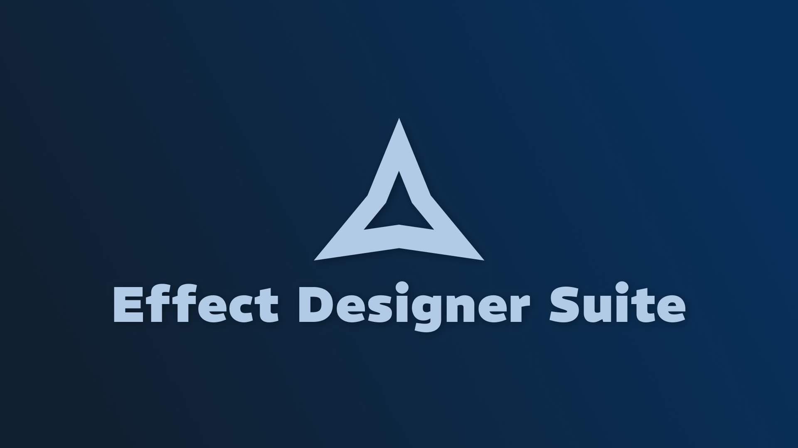
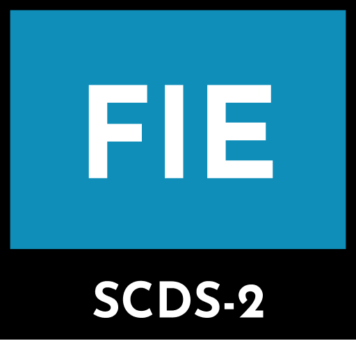

**Website: https://effect-designer.igottic.com/**

## Utilize emit properties
Compatible with other plugins, set emit count, delay, and duration on any emittable object. Emit once or repeat emit using emit actions.

## Tools for the mundane
Effect Designer Suite includes utility tools for copy-pasting properties, scaling, and more. Save time with these tools and scale beyond Roblox-intended value limits.

## Animate more with less
Use animation indicators to create bezier curves and tweens for attachments and base parts so that you can animate meshes, trails, beams, and more.

## Manage your assets
Manage your saved textures, meshes, and sounds using the asset library. Plus, get almost 7000 open-source preset flipbooks and static textures collected together for you to start with.

## Color beautifully
Create custom color sequences in the Oklab color space, which has more transitions between keypoints, allowing for a more natural and pretty look to your effects.

## Resize and more better
Number sequences (such as size) can be edited in the custom curve editor, which allows you to create quadratic curves for anything you make.

# Get Started
Get the plugin for FREE and receive lifetime updates!

https://create.roblox.com/store/asset/109890065116916/Effect-Designer-Suite

# SCDS Rating

**FIE:** Frequent AI usage for implementation, impacting experience.
